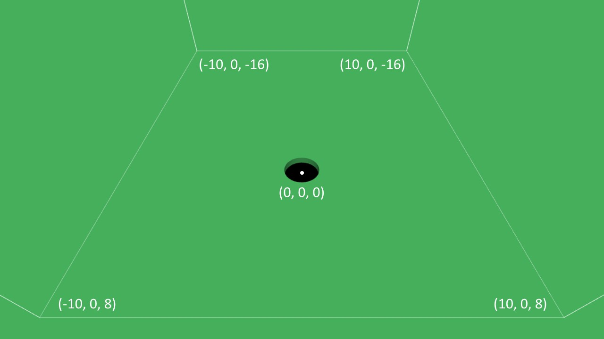
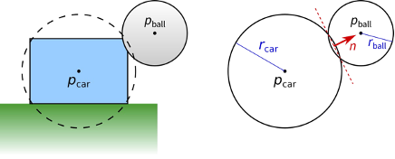
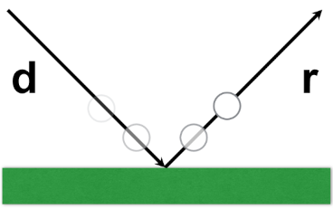

# Assignment 2: Hole in the Ground

## one late day

**Due: Tuesday, February 21, 11:59pm CDT**

The goal of this assignment is to create a fun 3D physics video game inspired by the delightfully clever 2018 game [Donut County](http://www.donutcounty.com/), which was created by indie developer [Ben Esposito](https://www.torahhorse.com/) based on a concept that originated during a game jam. In this game, the player controls a hole in the ground that increases in size each time an object falls inside it, eventually becoming large enough to swallow entire buildings.

This program covers a number of important computer graphics concepts.  Specifically, you will learn to:

- Use TypeScript and GopherGfx to build a 3D graphics program
- Draw simple 3D geometric objects
- Work effectively with 3D points, vectors, and geometric transformations
- Balance the tradeoffs between realism and effective gameplay by simulating physics in a plausible but not necessarily realistic way
- Successfully program your first interactive 3D graphics game!

You can try a [finished version of the game](https://csci-4611-spring-2023.github.io/Builds/Assignment-2/) in the Builds repository on the course GitHub. This is only a representative example, and you do not need to make your game look or play exactly the same. Your program can have a different look and feel, so long as it satisfies the requirements specified in the rubric.

## Submission Information

You should fill out this information before submitting your assignment. Make sure to document the name and source of any third party assets that you added, such as models, images, sounds, or any other content used that was not solely written by you. 

Name: Alexa Heidgerken

Third Party Assets:

Wizard Bonus Functionality:
    game has extra phase with lots of moving balls and one large stationary.

## Prerequisites

To work with this code, you will first need to install [Node.js 18.13.0 LTS](https://nodejs.org/) and [Visual Studio Code](https://code.visualstudio.com/). 

## Getting Started

The starter code implements the general structure that we reviewed in lecture.  After cloning your repository, you will need to set up the initial project by pulling the dependencies from the node package manager with:

```
npm install
```

This will create a `node_modules` folder in your directory and download all the dependencies needed to run the project.  Note that this folder is listed in the `.gitignore` file and should not be committed to your repository.  After that, you can compile and run a server with:

```
npm run start
```

Your program should open in a web browser automatically.  If not, you can run it by pointing your browser at `http://localhost:8080`.

## Game Description

The game is designed around a similar core mechanic as Donut County, albeit with a simplified physics model. The user controls the hole using the WASD/arrow keys, mouse, or touchscreen, and the hole will grow larger whenever an object falls inside it.  The following diagram shows the coordinate system used in the game. Note that we are using the standard OpenGL right-handed coordinate system where +X is to the right, +Y is up, and -Z is forward.



#### Simulating Physics

Most video games are designed to balance the tradeoff between physical realism and gameplay. A completely realistic simulation of all the physical interactions between moving objects can be very mathematically complex and potentially difficult to play the game on a 2D screen, especially with the limited amount of control possible using a keyboard/mouse or controller input. Although we generally want objects interact to in a "physically plausible" way, using physics models that approximate or even change the laws of physics (e.g., gravity) can often result in gameplay that is more fun and engaging.

Donut County is a great example of a game that makes effective use of "magical" physics.  As Ben Esposito discovered, making a hole in computer graphics is actually much trickier than it sounds, and this [Rock Paper Shotgun article](https://www.rockpapershotgun.com/how-donut-countys-hole-works) has a very interesting discussion of the physical approximations and fakery that he used when developing the game.  For the purposes of this programming assignment, we will further simplify the simulation by assuming that all moving objects are spheres, which will make our physics calculations more mathematically straightforward and computationally efficient.

#### Rigid Body Dynamics

The movement and interaction of solid, inflexible objects is known as rigid body dynamics, which is the most commonly used physical simulations in computer graphics and video games. This [introduction to video game physics](https://www.toptal.com/game/video-game-physics-part-i-an-introduction-to-rigid-body-dynamics) provides a nice supplemental reading if you are interested in learning more about the concepts and math involved in simulating rigid body dynamics.

To make this assignment practical to implement, we will make a few simplifying assumptions about the physics. Specifically, you should follow these guidelines in your code.

**Motion:** When implementing rigid body physics, the change in the object's position *p* is computed using its velocity *v*. This occurs each frame in the `update()` method of the `RigidBody` class, using the formula described in class: *p'* = *p* + *v* * *dt*.

**Friction:** To simulate friction, you can simply reduce the velocity of the rigid body when it hits something. For example, you might multiply the current speed by 0.9 after a bounce, which would slow it down by 10% due to friction.  The starter code already includes the friction slow down parameter used in the instructor's example.

**Gravity:** The rigid body should accelerate downward due to gravity, but this should be a plausible approximation of gravity. This is, after all, a game where objects are falling into a magical hole in the ground. The starter code already includes the gravity constant used in the instructor's example.

#### Detecting Collisions

One of the main challenges in this assignment is handling collisions between two rigid bodies. For collision purposes, we will assume all objects are approximated using spheres, so we only need to detect whether these two spheres are intersecting. This simplifies collision tests and it is not as unusual of a simplification as you might think. In games, it is typical to test for collisions using a "proxy geometry" that is much simpler than the 3D model that is actually drawn on the screen. With this approach, you can calculate fast, approximate physics while also having good looking graphics. For example, the diagram below illustrates a collision between a ball and a car, both of which are approximated using spheres. Of course, this may result in detecting collisions when the car's rendered geometry does not actually hit the ball, or vice versa, but as long as the size of the proxy sphere and the car model are not too different, it shouldn't matter too much to the gameplay.



In any collision handling routine, there are two main steps: first, detecting whether a collision has occurred, and second, resolving the collision by updating the positions and velocities of the colliding objects. With spheres, collision detection is easy: two spheres have collided if the distance between their centers is less than or equal to the sum of their radii.  You can perform this calculation manually, or you can call each transform's `intersects()` method using `gfx.IntersectionMode3.BOUNDING_SPHERE` as the intersection mode parameter.

#### Updating Position After a Collision

Notice that the figure illustrates the case where the two spheres overlap each other. In other words, one has passed inside the other. In real life, if you have two solid spheres, this case would never occur. The spheres would bounce off each other before penetrating each other. However, this happens quite regularly in computer graphics simulation. If you update your simulation once each frame, that means the elapsed time (i.e., `deltaTime` or *dt)* between consecutive frames will be somewhere around 1/30–1/60 second. That is fast, but still not fast enough to capture the *exact* moment when the two rigid bodies first make contact. This means that if you update the position of the rigid body, you may have a situation where *p'* ends up being inside the other object or inside the floor or wall of the play area. When you detect this has occurred, you should calculate a corrected position for the rigid body that places it just outside of the obstacle, as shown in the diagram below.


#### Updating Velocity After a Collision

When a rigid body bounces off another object, its velocity *v* changes, but how? It depends on the normal of the surface they come into contact. The following illustration shows a sphere bouncing off the ground plane. In this case, computing updating the sphere's velocity is very straightforward; we simply negate *v.y*, leaving *v.x* and *v.z* unchanged.



However, if the sphere bounces off an inclined plane, the math gets a bit more complicated, as shown in the diagram below.


The sphere approaches with a velocity vector *v*. When the sphere bounces, its velocity is reflected about the plane normal *n*. The equation for its new, reflected velocity *r* is shown above. This is actually a general formula for reflecting any vector about another vector. This gets used in computer graphics lighting equations as well. Note that it involves a dot product!  Conveniently, the `Vector3` class a built-in function to compute this reflection, given *v* and *n* as input parameters.

So, if this is how a sphere bounces off an inclined plane, what about colliding with another sphere? Actually, we can use the exact same equation. We just need the normal at the exact point where the spheres touch. **For a collision between two spheres, this normal can be computed by taking the difference between the two sphere centers and then normalizing the vector.**   You can then call the `Vector3.reflect()` function, which implements the above equation to reflect the vector about the collision normal.

In summary, your code to handle the collisions between two rigid bodies should follow these steps, each of which involves the kind of 3D graphics math, working with points and vectors, that we have been learning about in class.

- Detect that the two spheres have collided (and probably penetrated each other).
- "Correct" the collision by adjusting both the positions of both spheres so that they are no longer intersecting.
- Compute the relative velocity of each sphere, for example: *vrel1*= *vsphere1* – *vsphere2*.
- Compute the collision normal for each sphere, for example: *norm1* = *psphere1* - *psphere2*.
- Set the new velocity of each sphere by reflecting its relative velocity about the collision normal, for example: *vphere1 = gfx.Vector3.reflect(vrel1, norm1)*.
- Multiply each sphere's velocity by 0.5. This is necessary because the total amount of kinetic energy needs to be divided equally between the two spheres.
- Finally, multiply each sphere's velocity by the friction slow down constant. This accounts for some loss of momentum due to friction.

## Rubric

Graded out of 20 points.

#### Part 1: Hole Movement

- Currently, the user can move the hole infinitely in the X and Z directions.  Add boundary checks that prevent the hole from leaving the playing area.  (2)

#### Part 2: Rigid Body Physics

In this part, you will need to complete the code in the `RigidBody` class to make the spheres move according to the physics model described above.  

- First, you should define the downward acceleration due to gravity. (2)
- Next, compute the update the velocity and position of the object. When these steps are working correctly, the red sphere will be launched in an upwards arc and then fall inside the hole. (2)

#### Part 3: Boundary Collisions

- Complete the code in the `handleBoundaryCollision()` method to detect contact between a rigid body and the ground, and then make it bounce in the correct direction. (1)
- After that is working, extend this method to also make the spheres bounce off the four walls. When these steps are working correctly, all the spheres in the test scene should bounce off the boundaries to remain in the play area unless they fall inside the hole. (2)
- Finally, to make the collisions more plausible, we should slow down the rigid body after the collision using the `frictionSlowDown` parameter. (1)

#### Part 4: Handling Rigid Body Collisions

- Complete the code in the `handleObjectCollision()` to detect contact between spheres.  (2)
- If a collision is detected, correct the position of each sphere so they are no longer intersecting. (2)
- Compute the reflected velocity of each sphere using the physics equations described above. (2)

#### Part 5: Create Your Own Game

For the last part of this assignment, you should add code in the `startNextStage()` method to create your own custom scene that will be loaded after the user completes the test scene.  You have a lot of freedom to create your own game, as long as it meets these minimum requirements:

- Your game should include at least 8 rigid bodies. (1)
- Each object should vary in size. (1)
- Winning the game requires getting smaller objects first to make the hole large enough to get the larger objects. (1)
- The game should not be trivial to complete. For example, just placing stationary objects on the ground would not be sufficient. You could compute random velocities, set up a [Rube Goldberg machine](https://en.wikipedia.org/wiki/Rube_Goldberg_machine), or arrange them in some sort of puzzle. Creativity is encouraged! (1) 


## Wizard Bonus Challenge

All of the assignments in the course will include great opportunities for students to go beyond the requirements of the assignment and do cool extra work. On each assignment, you can earn **one bonus point** for implementing a meaningful new feature to your program. This should involve some original new programming, and should not just be something that can be quickly implemented by copying and slightly modifying existing code.  

A single point may not sound like a lot, but keep in mind that on a 20-point scale, this is equivalent to a 5% bonus! Make sure to document your wizard functionality in the Submission Information portion of this readme file, so that the TAs know what to look for when they grade your program.

The wizard bonus challenge also offers you a chance to show off your skills and creativity!  While grading the assignments the TAs will identify the best four or five examples of people doing cool stuff with computer graphics. We call these students our **wizards**, and after each assignment, the students selected as wizards will have their programs demonstrated to the class.

Additionally, for this assignment only, there is a **special advanced bonus** opportunity of one additional point for students that want to try and extend the physics model to handle complex objects or interactions. For example, Donut County uses bounding boxes instead of spheres and also considers angular velocity so that objects can "tip over" into the hole. Note that the math here can get very complicated, so this is not for the faint of heart! Alternatively, you could try to integrate an open-source 3D physics engine such as [ammo.js](https://github.com/kripken/ammo.js/) or [cannon.js](https://github.com/schteppe/cannon.js), but this comes with its own set of challenges, and it is unlikely that the TAs will be able to help debugging the use of third-party libraries.

## Submission

When you commit and push your assignment to GitHub, an automated script will build and deploy the production code to the `gh-pages` branch of your repository.  However, your submission is **not complete** until you do the following:

1. Open your repository on GitHub and go to Settings->Pages.
2. Change the source to the `gh-pages` branch, then save.


You will need to wait a few minutes for the website to deploy.  After that, make sure to test everything by pointing your web browser at the link generated for your build:

```
https://csci-4611-spring-2023.github.io/your-repo-name-here
```

If your program runs correctly, then you are finished!  The published build will indicate to the TAs that your assignment is ready for grading.  If you change your mind and want to make further changes to your code, then just set the GitHub pages source back to `None` and it will unpublish the website.

Note that the published JavaScript bundle code generated by the TypeScript compiler has been obfuscated so that it is not human-readable. So, you can feel free to send this link to other students, friends, and family to show off your work!

## Acknowledgments

This game uses royalty-free sound effects from [ZapSplat](https://www.zapsplat.com/).

## License

Material for [CSCI 4611 Spring 2023](https://csci-4611-spring-2023.github.io) by [Evan Suma Rosenberg](https://illusioneering.umn.edu/) is licensed under a [Creative Commons Attribution-NonCommercial-ShareAlike 4.0 International License](http://creativecommons.org/licenses/by-nc-sa/4.0/).
